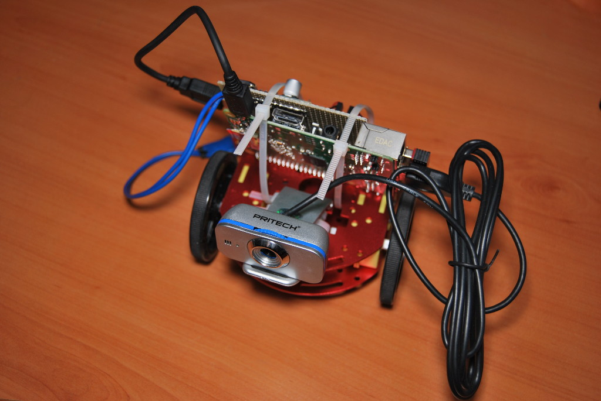
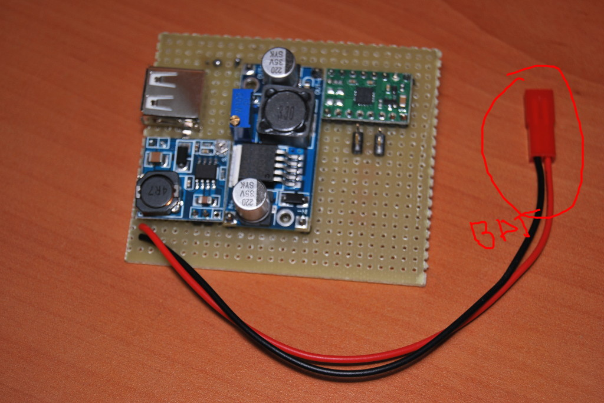
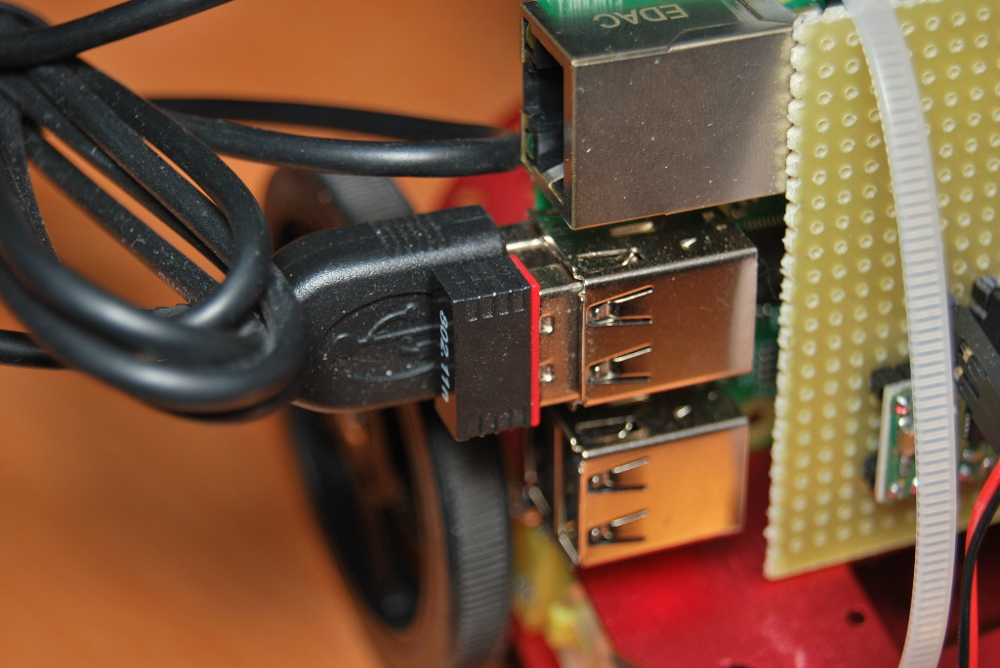
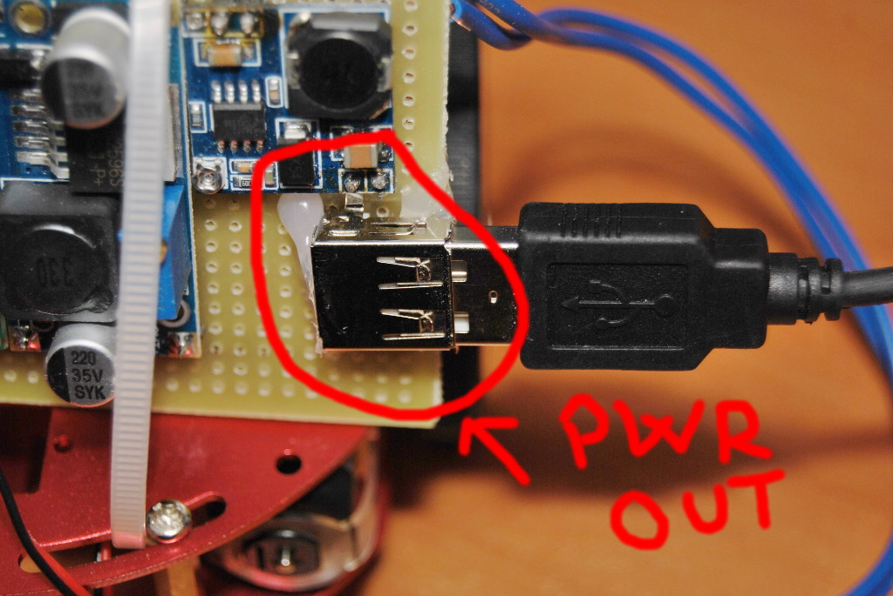
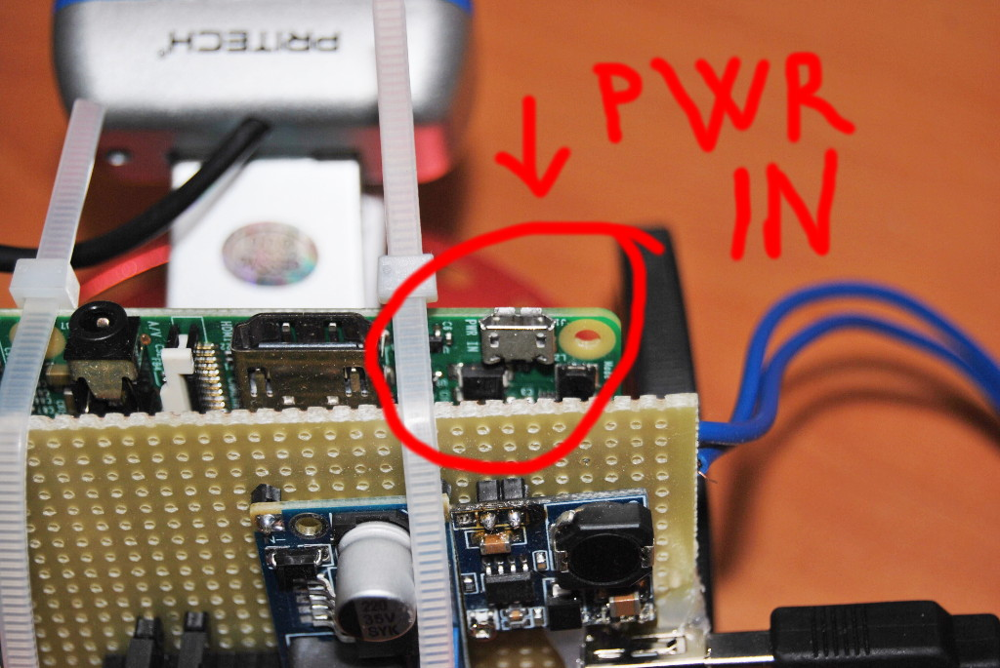

# Puesta en marcha

## Montaje y conexionado de elementos
### Batería
Conectar la batería al conector de batería de la shield:

### Webcam y Adaptador WiFi
Conectar a los USBs de la Raspberry Pi:

### Alimentación
Conectar la salida de potencia de la shield a la entrada de potencia de la Raspberry Pi.

Tras realizar esta conexión la Raspberry Pi debería *bootear*.

